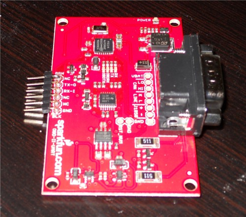

# Sample: UART (high-level app)

This sample demonstrates how to communicate over UART on an MT3620 development board.

This sample does the following:

- Opens a UART serial port with a baud rate of 9600.
- Sends OBD2 command from the device over the UART when button A is pressed.
- Get and displays the data received from the UART in the Visual Studio Output Window.
- Send data to MQTT broker over Wi-Fi

This sample uses these Applibs APIs:

| Library | Purpose |
|---------|---------|
| [UART](https://docs.microsoft.com/azure-sphere/reference/applibs-reference/applibs-uart/uart-overview) | Manages UART connectivity on the device |
| [GPIO](https://docs.microsoft.com/azure-sphere/reference/applibs-reference/applibs-gpio/gpio-overview) | Manages button A on the device |
| [log](https://docs.microsoft.com/azure-sphere/reference/applibs-reference/applibs-log/log-overview) | Displays messages in the Visual Studio Device Output window during debugging |
| [EventLoop](https://docs.microsoft.com/en-gb/azure-sphere/reference/applibs-reference/applibs-eventloop/eventloop-overview) | Invoke handlers for IO and timer events |

## Contents
| File/folder | Description |
|-------------|-------------|
|   main.c    | Sample source file. |
| app_manifest.json |Sample manifest file. |
| CMakeLists.txt | Contains the project information and produces the build. |
| CMakeSettings.json| Configures Visual Studio to use CMake with the correct command-line options. |
|launch.vs.json |Tells Visual Studio how to deploy and debug the application.|
| README.md | This readme file. |
|.vscode |Contains settings.json that configures Visual Studio Code to use CMake with the correct options, and tells it how to deploy and debug the application. |

## Prerequisites

**Note:** By default, this sample targets [MT3620 reference development board (RDB)](https://docs.microsoft.com/azure-sphere/hardware/mt3620-reference-board-design) hardware, such as the MT3620 development kit from Seeed Studios. To build the sample for different Azure Sphere hardware, change the Target Hardware Definition Directory in the project properties. For detailed instructions, see the [README file in the Hardware folder](../../../Hardware/README.md). You may also have to set the hardware differently.

This sample requires the following hardware:

- Azure Sphere MT3620 board
- SparkFun Car Diagnostic Kit

On header 2 (marked H2) on the lower left side of the board:

- Connect pins 1 and 3 (ISU0 RXD and ISU0 TXD) of H2 with a jumper header. These are the first two pins on the left side of the header, circled in red in the figure.

    

On the outside edge of the SparkFun Car Diagnostic Kit, is a 6-pin connector that is compatible with an FTDI board. Connect the pins to Sphere as following
- Spark Tx to Sphere ISU 0 Rx
- Spark Rx to Sphere ISU 0 Tx

    

## Prepare the sample

1. Even if you've performed this setup previously, ensure you have Azure Sphere SDK version 20.04 or above. At the command prompt, run **azsphere show-version** to check. Install [the Azure Sphere SDK](https://docs.microsoft.com/azure-sphere/install/install-sdk) as needed.
1. Connect your Azure Sphere device to your computer by USB.
1. Enable application development, if you have not already done so, by entering the following line at the command prompt:

   `azsphere device enable-development`

## Build and run the sample

See the following Azure Sphere Quickstarts to learn how to build and deploy this sample:

   -  [with Visual Studio](https://docs.microsoft.com/azure-sphere/install/qs-blink-application)
   -  [with VS Code](https://docs.microsoft.com/azure-sphere/install/qs-blink-vscode)
   -  [on the Windows command line](https://docs.microsoft.com/azure-sphere/install/qs-blink-cli)
   -  [on the Linux command line](https://docs.microsoft.com/azure-sphere/install/qs-blink-linux-cli)

1. Add MQTT broker IP address in app_manifest.json (allowed_connection) and main.c (mqttConf_brokerIp)

### Test the sample

1. Every 500ms Sphere will sends OBD2 command (5 bytes) over the UART connection and displays the sent and received text in the Visual Studio Device Output window:

   `Sent 5 bytes over UART in 1 calls.`  
   `Waiting Engine RPM`  
   `UART received 12 bytes: 010C`
   `41 0C 0`  
   `'`

